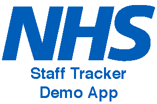

<div id="top"></div>
<!--
*** Thanks for checking out the Best-README-Template. If you have a suggestion
*** that would make this better, please fork the repo and create a pull request
*** or simply open an issue with the tag "enhancement".
*** Don't forget to give the project a star!
*** Thanks again! Now go create something AMAZING! :D
-->


<!-- PROJECT SHIELDS -->
<!--
*** I'm using markdown "reference style" links for readability.
*** Reference links are enclosed in brackets [ ] instead of parentheses ( ).
*** See the bottom of this document for the declaration of the reference variables
*** for contributors-url, forks-url, etc. This is an optional, concise syntax you may use.
*** https://www.markdownguide.org/basic-syntax/#reference-style-links
-->
[![Contributors][contributors-shield]][contributors-url]
[![Forks][forks-shield]][forks-url]
[![Stargazers][stars-shield]][stars-url]
[![Issues][issues-shield]][issues-url]
[![MIT License][license-shield]][license-url]
[![Stackoverflow][stackoverflow-shield]][stackoverflow-url]


<!-- PROJECT LOGO -->
<br />
<div align="center">
  <a href="https://github.com/Andy-Donegan/NhsDemoApp">
    
  </a>

<h3 align="center">Nhs Mobile App Demo (Android Only)</h3>

  <p align="center">
    Great write up about App and what it does etc blah blah
    <br />
    <a href="https://github.com/Andy-Donegan/NhsDemoApp"><strong>Explore the docs »</strong></a>
    <br />
    <br />
    <a href="https://github.com/Andy-Donegan/NhsDemoApp">View Demo</a>
    ·
    <a href="https://github.com/Andy-Donegan/NhsDemoApp/issues">Report Bug</a>
    ·
    <a href="https://github.com/Andy-Donegan/NhsDemoApp/issues">Request Feature</a>
  </p>
</div>


<!-- TABLE OF CONTENTS -->
<details>
  <summary>Table of Contents</summary>
  <ol>
    <li>
      <a href="#about-the-project">About The Project</a>
      <ul>
        <li><a href="#built-with">Built With</a></li>
      </ul>
    </li>
    <li>
      <a href="#getting-started">Getting Started</a>
      <ul>
        <li><a href="#prerequisites">Prerequisites</a></li>
        <li><a href="#installation">Installation</a></li>
      </ul>
    </li>
    <li><a href="#usage">Usage</a></li>
    <li><a href="#roadmap">Roadmap</a></li>
    <li><a href="#contributing">Contributing</a></li>
    <li><a href="#license">License</a></li>
    <li><a href="#contact">Contact</a></li>
    <li><a href="#acknowledgments">Acknowledgments</a></li>
  </ol>
</details>


<!-- ABOUT THE PROJECT -->
## About The Project

[![Product Name Screen Shot][product-screenshot]](https://example.com)

Here's a blank template to get started: To avoid retyping too much info. Do a search and replace with your text editor for the following: `Andy-Donegan`, `NhsDemoApp`, `twitter_handle`, `linkedin_username`, `hotmail`, `andy_donegan`, `project_title`, `project_description`

<p align="right">(<a href="#top">back to top</a>)</p>


### Built With

* [Next.js](https://nextjs.org/)
* [React.js](https://reactjs.org/)
* [Vue.js](https://vuejs.org/)
* [Angular](https://angular.io/)
* [Svelte](https://svelte.dev/)
* [Laravel](https://laravel.com)
* [Bootstrap](https://getbootstrap.com)
* [JQuery](https://jquery.com)

<p align="right">(<a href="#top">back to top</a>)</p>


<!-- GETTING STARTED -->
## Getting Started

This is an example of how you may give instructions on setting up your project locally.
To get a local copy up and running follow these simple example steps.

### Prerequisites

This is an example of how to list things you need to use the software and how to install them.
* npm
  ```sh
  npm install npm@latest -g
  ```

### Installation

1. Get a free API Key at [https://example.com](https://example.com)
2. Clone the repo
   ```sh
   git clone https://github.com/Andy-Donegan/NhsDemoApp.git
   ```
3. Install NPM packages
   ```sh
   npm install
   ```
4. Enter your API in `config.js`
   ```js
   const API_KEY = 'ENTER YOUR API';
   ```

<p align="right">(<a href="#top">back to top</a>)</p>


<!-- USAGE EXAMPLES -->
## Usage

Use this space to show useful examples of how a project can be used. Additional screenshots, code examples and demos work well in this space. You may also link to more resources.

Add Images here to show off stuff etc.


<p align="right">(<a href="#top">back to top</a>)</p>


<!-- ROADMAP -->
## Roadmap

- There is no roadmap this simple demo is complete and will not receive any future updates.

<p align="right">(<a href="#top">back to top</a>)</p>


<!-- CONTRIBUTING -->
## Contributing

Contributions are what make the open source community such an amazing place to learn, inspire, and create, but this project is solely something I developed to help myself get back into programming.

You are free to do what ever with this project etc, but take it and do what you will within your own Repo.

<p align="right">(<a href="#top">back to top</a>)</p>


<!-- LICENSE -->
## License

Distributed under the MIT License. See `LICENSE.txt` for more information.

<p align="right">(<a href="#top">back to top</a>)</p>


<!-- CONTACT -->
## Contact

Andy Donegan - andy_donegan@hotmail.co.uk

Project Link: [https://github.com/Andy-Donegan/NhsDemoApp](https://github.com/Andy-Donegan/NhsDemoApp)

<p align="right">(<a href="#top">back to top</a>)</p>


<!-- ACKNOWLEDGMENTS -->
## Acknowledgments

* [Xamarin Local Notifications Plugin](https://github.com/thudugala/Plugin.LocalNotification)
* [Xamarin Forms Better Maps](https://github.com/dmariogatto/Xamarin.Forms.BetterMaps)
* [Choose an Open Source License](https://choosealicense.com)
* [Img Shields](https://shields.io)
* [Font Awesome](https://fontawesome.com)
* [OthNeil Drew(this readme template)](https://github.com/othneildrew/Best-README-Template)

<p align="right">(<a href="#top">back to top</a>)</p>


<!-- MARKDOWN LINKS & IMAGES -->
<!-- https://www.markdownguide.org/basic-syntax/#reference-style-links -->
[contributors-shield]: https://img.shields.io/github/contributors/Andy-Donegan/NhsDemoApp.svg?style=for-the-badge
[contributors-url]: https://github.com/Andy-Donegan/NhsDemoApp/graphs/contributors
[forks-shield]: https://img.shields.io/github/forks/Andy-Donegan/NhsDemoApp.svg?style=for-the-badge
[forks-url]: https://github.com/Andy-Donegan/NhsDemoApp/network/members
[stars-shield]: https://img.shields.io/github/stars/Andy-Donegan/NhsDemoApp.svg?style=for-the-badge
[stars-url]: https://github.com/Andy-Donegan/NhsDemoApp/stargazers
[issues-shield]: https://img.shields.io/github/issues/Andy-Donegan/NhsDemoApp.svg?style=for-the-badge
[issues-url]: https://github.com/Andy-Donegan/NhsDemoApp/issues
[license-shield]: https://img.shields.io/github/license/Andy-Donegan/NhsDemoApp.svg?style=for-the-badge
[license-url]: https://github.com/Andy-Donegan/NhsDemoApp/LICENSE.txt
[stackoverflow-shield]: https://img.shields.io/badge/SO-STACKOVERFLOW-lightgrey.svg?style=for-the-badge
[stackoverflow-url]: https://stackoverflow.com/users/4043829/andy-donegan
[product-screenshot]: images/screenshot.png

