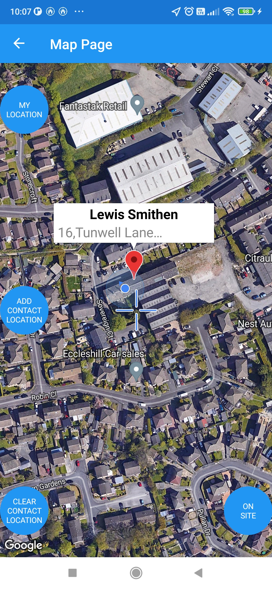
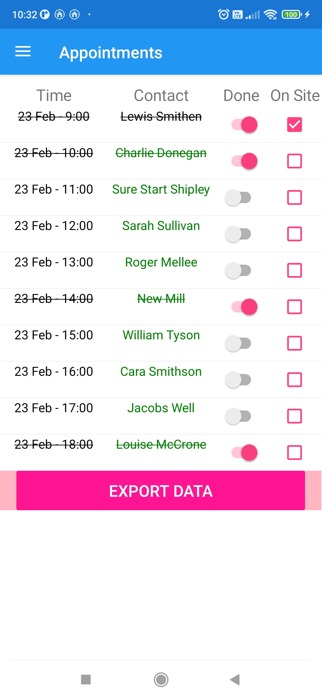
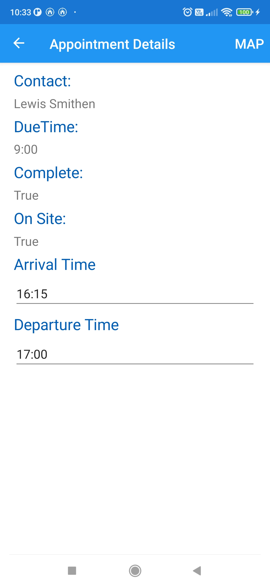

<div id="top"></div>
<!--
*** Thanks for checking out the Best-README-Template. If you have a suggestion
*** that would make this better, please fork the repo and create a pull request
*** or simply open an issue with the tag "enhancement".
*** Don't forget to give the project a star!
*** Thanks again! Now go create something AMAZING! :D
-->


<!-- PROJECT SHIELDS -->
<!--
*** I'm using markdown "reference style" links for readability.
*** Reference links are enclosed in brackets [ ] instead of parentheses ( ).
*** See the bottom of this document for the declaration of the reference variables
*** for contributors-url, forks-url, etc. This is an optional, concise syntax you may use.
*** https://www.markdownguide.org/basic-syntax/#reference-style-links
-->
[![Contributors][contributors-shield]][contributors-url]
[![Forks][forks-shield]][forks-url]
[![Stargazers][stars-shield]][stars-url]
[![Issues][issues-shield]][issues-url]
[![MIT License][license-shield]][license-url]
[![Stackoverflow][stackoverflow-shield]][stackoverflow-url]


<!-- PROJECT LOGO -->
<br />
<div align="center">
  <a href="https://github.com/Andy-Donegan/NhsDemoApp">
    
  </a>

<h3 align="center">Nhs Mobile App Demo (Android Only)</h3>

  <p align="center">
    Demo App for lone staff location monitoring and reporting to assist with Safety Operating Procedures.
    <br />
    <a href="https://github.com/Andy-Donegan/NhsDemoApp"><strong>Explore the docs »</strong></a>
    <br />
    <br />
  </p>
</div>


<!-- TABLE OF CONTENTS -->
<details>
  <summary>Table of Contents</summary>
  <ol>
    <li>
      <a href="#about-the-project">About The Project</a>
      <ul>
        <li><a href="#built-with">Built With</a></li>
      </ul>
    </li>
    <li>
      <a href="#getting-started">Getting Started</a>
      <ul>
        <li><a href="#prerequisites">Prerequisites</a></li>
        <li><a href="#installation">Installation</a></li>
      </ul>
    </li>
    <li><a href="#usage">Usage</a></li>
    <li><a href="#roadmap">Roadmap</a></li>
    <li><a href="#contributing">Contributing</a></li>
    <li><a href="#license">License</a></li>
    <li><a href="#contact">Contact</a></li>
    <li><a href="#acknowledgments">Acknowledgments</a></li>
  </ol>
</details>


<!-- ABOUT THE PROJECT -->
## About The Project
<br />
<div align="center">
  <a href="https://github.com/Andy-Donegan/NhsDemoApp">
    
  </a>
</div>

This began as a small project for myself whilst recovering from long term illness and to get myself back into programming. From discussion with an NHS health care worker regarding my previous job as a programmer they asked about an App to assist with lone worker safety and the current systems that they have in place. I took it upon myself to use this idea to produce a small demo to get myself into Xamarin and back to programming in C#, my previous cross mobile application (Swift Command) was written with Apache Cordova and was Html/Css/Javascript and Jquery with multiple plugins.

This demo is fully functioning it requires a network connection for gps positioning etc, all data within the App is saved on the device nothing is transmitted to remote servers.

The App is basically a diary with the ability to update appointments with the touch of a button, then add on site times and leaving times. A double tap of the appointment opens the map screen and the ability to add a marker for the current appointment location and also an onsite button which will updated which appointment is currently being attended.

The aim of the App is just to show how something like this can be stream lined to a couple of screens, there is much more required for this to be a good demo, but it was just a project to get myself producing code.

The project also has a demo Web admin/dashboard to allow overview and deal with escalations and reporting of data collected from the App this can be found here <a href="https://github.com/Andy-Donegan/NhsWebDemo">NHS Web Demo</a>

<p align="right">(<a href="#top">back to top</a>)</p>


### Built With

* [Xamarin](https://dotnet.microsoft.com/en-us/apps/xamarin)
* [Visual Studio 2022](https://visualstudio.microsoft.com/)
* [MVVM](https://docs.microsoft.com/en-us/xamarin/xamarin-forms/enterprise-application-patterns/mvvm)
* [Xamarin Forms Maps... but Better](https://dgatto.com/posts/2021/06/xforms-better-maps/)
* [Plugin.LocalNotification](https://github.com/thudugala/Plugin.LocalNotification)
* [Google Maps](https://developers.google.com/maps)
* [Open XML SDK](https://github.com/OfficeDev/Open-XML-SDK)

<p align="right">(<a href="#top">back to top</a>)</p>


<!-- GETTING STARTED -->
## Getting Started

This is an example of how you may give instructions on setting up your project locally.
To get a local copy up and running follow these simple example steps.

### Prerequisites

This is an example of how to list things you need to use the software and how to install them.
* npm
  ```sh
  npm install npm@latest -g
  ```

### Installation

1. Get a free API Key at [https://example.com](https://example.com)
2. Clone the repo
   ```sh
   git clone https://github.com/Andy-Donegan/NhsDemoApp.git
   ```
3. Install NPM packages
   ```sh
   npm install
   ```
4. Enter your API in `config.js`
   ```js
   const API_KEY = 'ENTER YOUR API';
   ```

<p align="right">(<a href="#top">back to top</a>)</p>


<!-- USAGE EXAMPLES -->
## Usage

Use this space to show useful examples of how a project can be used. Additional screenshots, code examples and demos work well in this space. You may also link to more resources.

Add Images here to show off stuff etc.
<div align="center">
  <a href="https://github.com/Andy-Donegan/NhsDemoApp">
    
  </a>
    <a href="https://github.com/Andy-Donegan/NhsDemoApp">
    
  </a>
    <a href="https://github.com/Andy-Donegan/NhsDemoApp">
    
  </a>
    </a>
    <a href="https://github.com/Andy-Donegan/NhsDemoApp">
    
  </a>
    </a>
    <a href="https://github.com/Andy-Donegan/NhsDemoApp">
    
  </a>
  </a>
    <a href="https://github.com/Andy-Donegan/NhsDemoApp">
    
  </a>
  </a>
    <a href="https://github.com/Andy-Donegan/NhsDemoApp">
    
  </a>
</div>

<p align="right">(<a href="#top">back to top</a>)</p>


<!-- ROADMAP -->
## Roadmap

- There is no roadmap this simple demo is complete and will not receive any future updates.

<p align="right">(<a href="#top">back to top</a>)</p>


<!-- CONTRIBUTING -->
## Contributing

Contributions are what make the open source community such an amazing place to learn, inspire, and create, but this project is solely something I developed to help myself get back into programming.

You are free to do what ever with this project etc, but take it and do what you will within your own Repo.

<p align="right">(<a href="#top">back to top</a>)</p>


<!-- LICENSE -->
## License

Distributed under the MIT License. See `LICENSE.txt` for more information.

<p align="right">(<a href="#top">back to top</a>)</p>


<!-- CONTACT -->
## Contact

Andy Donegan - andy_donegan@hotmail.co.uk

Project Link: [https://github.com/Andy-Donegan/NhsDemoApp](https://github.com/Andy-Donegan/NhsDemoApp)

<p align="right">(<a href="#top">back to top</a>)</p>


<!-- ACKNOWLEDGMENTS -->
## Acknowledgments

* [Xamarin Local Notifications Plugin](https://github.com/thudugala/Plugin.LocalNotification)
* [Xamarin Forms Better Maps](https://github.com/dmariogatto/Xamarin.Forms.BetterMaps)
* [Choose an Open Source License](https://choosealicense.com)
* [Img Shields](https://shields.io)
* [Font Awesome](https://fontawesome.com)
* [OthNeil Drew(this readme template)](https://github.com/othneildrew/Best-README-Template)

<p align="right">(<a href="#top">back to top</a>)</p>


<!-- MARKDOWN LINKS & IMAGES -->
<!-- https://www.markdownguide.org/basic-syntax/#reference-style-links -->
[contributors-shield]: https://img.shields.io/github/contributors/Andy-Donegan/NhsDemoApp.svg?style=for-the-badge
[contributors-url]: https://github.com/Andy-Donegan/NhsDemoApp/graphs/contributors
[forks-shield]: https://img.shields.io/github/forks/Andy-Donegan/NhsDemoApp.svg?style=for-the-badge
[forks-url]: https://github.com/Andy-Donegan/NhsDemoApp/network/members
[stars-shield]: https://img.shields.io/github/stars/Andy-Donegan/NhsDemoApp.svg?style=for-the-badge
[stars-url]: https://github.com/Andy-Donegan/NhsDemoApp/stargazers
[issues-shield]: https://img.shields.io/github/issues/Andy-Donegan/NhsDemoApp.svg?style=for-the-badge
[issues-url]: https://github.com/Andy-Donegan/NhsDemoApp/issues
[license-shield]: https://img.shields.io/github/license/Andy-Donegan/NhsDemoApp.svg?style=for-the-badge
[license-url]: https://github.com/Andy-Donegan/NhsDemoApp/LICENSE.txt
[stackoverflow-shield]: https://img.shields.io/badge/SO-STACKOVERFLOW-lightgrey.svg?style=for-the-badge
[stackoverflow-url]: https://stackoverflow.com/users/4043829/andy-donegan
